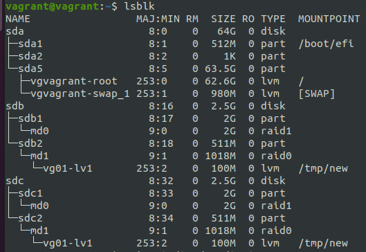
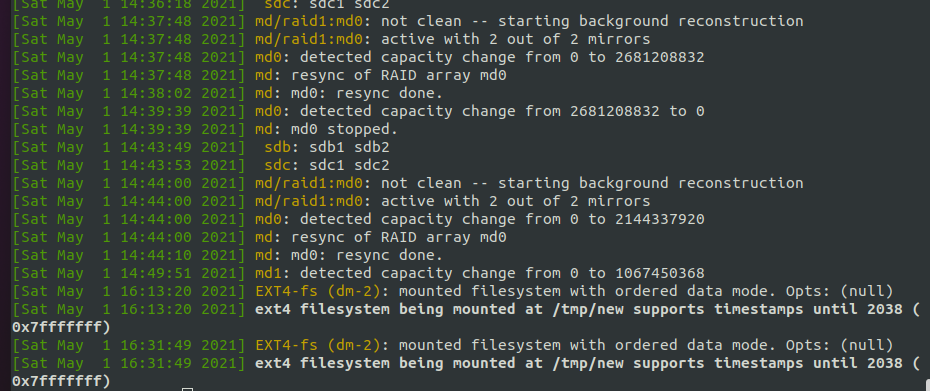

1. Узнайте о [sparse](https://ru.wikipedia.org/wiki/%D0%A0%D0%B0%D0%B7%D1%80%D0%B5%D0%B6%D1%91%D0%BD%D0%BD%D1%8B%D0%B9_%D1%84%D0%B0%D0%B9%D0%BB) (разряженных) файлах.

1. Могут ли файлы, являющиеся жесткой ссылкой на один объект, иметь разные права доступа и владельца? Почему?
   - **Нет, не могут. Это связанно с тем что исходный файл и все жесткие диски указывают на один и тот же участок жесткого диска**

1. Сделайте `vagrant destroy` на имеющийся инстанс Ubuntu. Замените содержимое Vagrantfile следующим:

    ```bash
    Vagrant.configure("2") do |config|
      config.vm.box = "bento/ubuntu-20.04"
      config.vm.provider :virtualbox do |vb|
        lvm_experiments_disk0_path = "/tmp/lvm_experiments_disk0.vmdk"
        lvm_experiments_disk1_path = "/tmp/lvm_experiments_disk1.vmdk"
        vb.customize ['createmedium', '--filename', lvm_experiments_disk0_path, '--size', 2560]
        vb.customize ['createmedium', '--filename', lvm_experiments_disk1_path, '--size', 2560]
        vb.customize ['storageattach', :id, '--storagectl', 'SATA Controller', '--port', 1, '--device', 0, '--type', 'hdd', '--medium', lvm_experiments_disk0_path]
        vb.customize ['storageattach', :id, '--storagectl', 'SATA Controller', '--port', 2, '--device', 0, '--type', 'hdd', '--medium', lvm_experiments_disk1_path]
      end
    end
    ```

    Данная конфигурация создаст новую виртуальную машину с двумя дополнительными неразмеченными дисками по 2.5 Гб.

1. Используя fdisk, разбейте первый диск на 2 раздела: 2 Гб, оставшееся пространство.
   - **fdisk /dev/sdb**
      - **n**
      - **+2G**
   - **fdisk /dev/sdc**
       - **n** 

1. Используя sfdisk, перенесите данную таблицу разделов на второй диск.
   - **sfdisk --dump /dev/sdb > sdb-tabels.txt**
   - **sfdisk /dev/sdc < sdb-tabels.txt**

1. Соберите mdadm RAID1 на паре разделов 2 Гб.
   - **mdadm --create --verbose /dev/md0 -l 1 -n 2 /dev/sd{b,c}1**
     
1. Соберите `mdadm` RAID0 на второй паре маленьких разделов.
   - **mdadm --create --verbose /dev/md1 -l 0 -n 2 /dev/sd{b,c}2**
   
1. Создайте 2 независимых PV на получившихся md-устройствах.
   - **pvcreate /dev/md0**
   - **pvcreate /dev/md1**
   
1. Создайте общую volume-group на этих двух PV.
   - **vgcreate vg01 /dev/md1 /dev/md0**
   
1. Создайте LV размером 100 Мб, указав его расположение на PV с RAID0.
   - **lvcreate -L100M -n lv1 vg01**
   
1. Создайте mkfs.ext4 ФС на получившемся LV.
   - **mkfs.ext4 /dev/vg01/lv1**
   
1. Смонтируйте этот раздел в любую директорию, например, /tmp/new.
   - **mount /dev/vg01/lv1 /tmp/new**
   
1. Поместите туда тестовый файл, например `wget https://mirror.yandex.ru/ubuntu/ls-lR.gz -O /tmp/new/test.gz`.
   
1. Прикрепите вывод lsblk.    
   - 
   
1. Протестируйте целостность файла:

    ```bash
    root@vagrant:~# gzip -t /tmp/new/test.gz
    root@vagrant:~# echo $?
    0
    ```

1. Используя pvmove, переместите содержимое PV с RAID0 на RAID1.
   - **pvmove /dev/md1 /dev/md0**
   
1. Сделайте --fail на устройство в вашем RAID1 md.
   - **mdadm --fail /dev/md0**
   
1. Подтвердите выводом dmesg, что RAID1 работает в деградированном состоянии.
   - 
   
1. Протестируйте целостность файла, несмотря на "сбойный" диск он должен продолжать быть доступен:

    ```bash
    root@vagrant:~# gzip -t /tmp/new/test.gz
    root@vagrant:~# echo $?
    0
    ```

1. Погасите тестовый хост, `vagrant destroy`.