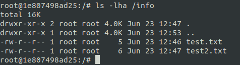

# Домашнее задание к занятию "5.3. Контейнеризация на примере Docker"

## Задача 1 

Посмотрите на сценарий ниже и ответьте на вопрос:
"Подходит ли в этом сценарии использование докера? Или лучше подойдет виртуальная машина, физическая машина? Или возможны разные варианты?"

Детально опишите и обоснуйте свой выбор.

--

Сценарий:

- Высоконагруженное монолитное java веб-приложение;
    - **Больше всего подойдет физическая машина, для максимального доступа к ресурсам системы**
- Go-микросервис для генерации отчетов;
    - **Использование докера подходит, данный сервис не требователен к ресурсам, а так-же будет возможность легко перенести на другую машину**
- Nodejs веб-приложение;
    - **Подойдет докер, позволит просто менять версию ноды и так-же не требователенно к ресурсам**
- Мобильное приложение c версиями для Android и iOS;
    - **Да, подойдет, можно будет проще управлять переменными окружения для различных версий приложений**
- База данных postgresql используемая, как кэш;
    - **В данном случае будет лучше использовать физическую машину, для быстрого доступа к кэшу**
- Шина данных на базе Apache Kafka;
    - **Лучше будет использовать физическую машину для целостности данных**
- Очередь для Logstash на базе Redis;
    - **Лучше будет использовать физическую машину для целостности данных**
- Elastic stack для реализации логирования продуктивного веб-приложения - три ноды elasticsearch, два logstash и две ноды kibana;
    - **Подойдет использование докера, приложения не требователенны к ресурсам и данные не являются приоритетными**
- Мониторинг-стек на базе prometheus и grafana;
    - **Да, подойдет, благодаря простой и быстрой настройки окружения**
- Mongodb, как основное хранилище данных для java-приложения;
    - **Докер не подойдет, из-за опасности потерять данные. Можно выбрать между физической или виратулаьной машиной**
- Jenkins-сервер.
    - **Подойдет докер, для быстрого разворачивания сервера. Так-же не требователен к ресурсам**

## Задача 2 

Сценарий выполения задачи:

- создайте свой репозиторий на докерхаб; 
- выберете любой образ, который содержит апачи веб-сервер;
- создайте свой форк образа;
- реализуйте функциональность: 
запуск веб-сервера в фоне с индекс-страницей, содержащей HTML-код ниже: 
```
<html>
<head>
Hey, Netology
</head>
<body>
<h1>I’m kinda DevOps now</h1>
</body>
</html>
```
Опубликуйте созданный форк в своем репозитории и предоставьте ответ в виде ссылки на докерхаб-репо.
   - **https://hub.docker.com/repository/docker/kafka0238/netology/general**

## Задача 3 

- Запустите первый контейнер из образа centos c любым тэгом в фоновом режиме, подключив папку info из текущей рабочей директории на хостовой машине в /share/info контейнера;
   - `docker run -dti --name centos -v /info:/share/info centos`
- Запустите второй контейнер из образа debian:latest в фоновом режиме, подключив папку info из текущей рабочей директории на хостовой машине в /info контейнера;
   - `docker run -dti --name debian -v /info:/info debian:latest`
- Подключитесь к первому контейнеру с помощью exec и создайте текстовый файл любого содержания в /share/info ;
   - `docker exec -ti centos bash`
   - `cd /share/info`
   - `touch test.txt`
- Добавьте еще один файл в папку info на хостовой машине
   - `cd /info`
   - `touch test2.txt`
- Подключитесь во второй контейнер и отобразите листинг и содержание файлов в /info контейнера.
   - `docker exec -ti debian bash`
   - `ls -lha /info`

