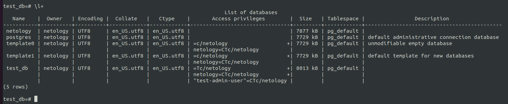

# Домашнее задание к занятию "6.2. SQL"

## Введение

Перед выполнением задания вы можете ознакомиться с 
[дополнительными материалами](https://github.com/netology-code/virt-homeworks/tree/master/additional/README.md).

## Задача 1

Используя docker поднимите инстанс PostgreSQL (версию 12) c 2 volume, 
в который будут складываться данные БД и бэкапы.

Приведите получившуюся команду или docker-compose манифест.

## Задача 2

В БД из задачи 1: 
- создайте пользователя test-admin-user и БД test_db
  - `create user "test-admin-user" with password 'test-admin-user';`
  - `create database test_db;`
- в БД test_db создайте таблицу orders и clients (спeцификация таблиц ниже)
  - `\c test_db`
  - `CREATE TABLE orders (id SERIAL PRIMARY KEY, name CHARACTER VARYING(100), price INTEGER);`
  - `CREATE TABLE clients (id SERIAL PRIMARY KEY, lastname CHARACTER VARYING(100), county CHARACTER VARYING(100), order_id INTEGER, FOREIGN KEY (order_id) REFERENCES orders (id));`
  - `CREATE INDEX country_idx ON clients (county);`   
- предоставьте привилегии на все операции пользователю test-admin-user на таблицы БД test_db
  - `GRANT ALL PRIVILEGES ON DATABASE test_db to "test-admin-user";`
- создайте пользователя test-simple-user  
  - `create user "test-simple-user" with password 'test-simple-user';`
- предоставьте пользователю test-simple-user права на SELECT/INSERT/UPDATE/DELETE данных таблиц БД test_db
  - `GRANT SELECT, INSERT, UPDATE, DELETE ON clients to "test-simple-user";`
  - `GRANT SELECT, INSERT, UPDATE, DELETE ON orders to "test-simple-user";`

Таблица orders:
- id (serial primary key)
- наименование (string)
- цена (integer)

Таблица clients:
- id (serial primary key)
- фамилия (string)
- страна проживания (string, index)
- заказ (foreign key orders)

Приведите:
- итоговый список БД после выполнения пунктов выше,
  
- описание таблиц (describe)
  
  
- SQL-запрос для выдачи списка пользователей с правами над таблицами test_db
  
- список пользователей с правами над таблицами test_db
  

## Задача 3

Используя SQL синтаксис - наполните таблицы следующими тестовыми данными:

Таблица orders

|Наименование|цена|
|------------|----|
|Шоколад| 10 |
|Принтер| 3000 |
|Книга| 500 |
|Монитор| 7000|
|Гитара| 4000|

Таблица clients

|ФИО|Страна проживания|
|------------|----|
|Иванов Иван Иванович| USA |
|Петров Петр Петрович| Canada |
|Иоганн Себастьян Бах| Japan |
|Ронни Джеймс Дио| Russia|
|Ritchie Blackmore| Russia|

Используя SQL синтаксис:
- вычислите количество записей для каждой таблицы 
- приведите в ответе:
    - запросы 
    - результаты их выполнения.
  
  
  - `INSERT INTO orders (name, price) VALUES ('Шоколад', 10);`
  - `INSERT INTO orders (name, price) VALUES ('Принтер', 3000);`
  - `INSERT INTO orders (name, price) VALUES ('Книга', 500);`
  - `INSERT INTO orders (name, price) VALUES ('Монитор', 7000);`
  - `INSERT INTO orders (name, price) VALUES ('Гитара', 4000);`

  
  - `INSERT INTO clients (lastname, county) VALUES ('Иванов Иван Иванович', 'USA');`
  - `INSERT INTO clients (lastname, county) VALUES ('Петров Петр Петрович', 'Canada');`
  - `INSERT INTO clients (lastname, county) VALUES ('Иоганн Себастьян Бах', 'Japan');`
  - `INSERT INTO clients (lastname, county) VALUES ('Ронни Джеймс Дио', 'Russia');`
  - `INSERT INTO clients (lastname, county) VALUES ('Ritchie Blackmore', 'Russia');`

  - `SELECT COUNT(*) FROM orders;`

  - `SELECT COUNT(*) FROM clients;`

## Задача 4

Часть пользователей из таблицы clients решили оформить заказы из таблицы orders.

Используя foreign keys свяжите записи из таблиц, согласно таблице:

|ФИО|Заказ|
|------------|----|
|Иванов Иван Иванович| Книга |
|Петров Петр Петрович| Монитор |
|Иоганн Себастьян Бах| Гитара |

Приведите SQL-запросы для выполнения данных операций.
  - `UPDATE clients SET order_id = (SELECT id FROM orders WHERE name = 'Книга') WHERE lastname = 'Иванов Иван Иванович';`
  - `UPDATE clients SET order_id = (SELECT id FROM orders WHERE name = 'Монитор') WHERE lastname = 'Петров Петр Петрович';`
  - `UPDATE clients SET order_id = (SELECT id FROM orders WHERE name = 'Гитара') WHERE lastname = 'Иоганн Себастьян Бах';`

Приведите SQL-запрос для выдачи всех пользователей, которые совершили заказ, а также вывод данного запроса.
 
  - `SELECT c.lastname, c.county, o.name, o.price from clients c INNER JOIN orders o ON c.order_id = o.id;`

Подсказк - используйте директиву `UPDATE`.

## Задача 5

Получите полную информацию по выполнению запроса выдачи всех пользователей из задачи 4 
(используя директиву EXPLAIN).

Приведите получившийся результат и объясните что значат полученные значения.
  - `EXPLAIN SELECT c.lastname, c.county, o.name, o.price from clients c INNER JOIN orders o ON c.order_id = o.id;`

  - **Hash Join - операция для объединения таблиц по хэшу**
  - **cost - затратность операции**
  - **rows - заплонированное количество строк планировщиком**
  - **width - средний размер одной строки в байтах**
  - **Hash Cond - указывается каких данных сравнивается хэш**
  - **Seq Scan - последовательное, блок за блоком, чтение данных таблицы**
  - **Hash - вычисление хэша для каждой строки**
## Задача 6

Создайте бэкап БД test_db и поместите его в volume, предназначенный для бэкапов (см. Задачу 1).

Остановите контейнер с PostgreSQL (но не удаляйте volumes).

Поднимите новый пустой контейнер с PostgreSQL.

Восстановите БД test_db в новом контейнере.

Приведите список операций, который вы применяли для бэкапа данных и восстановления. 
  - `pg_dump test_db > /dump/test_db.sql -U netology -C`
  - `psql  -c 'create database test_db' -U netology`
  - `psql test_db < /dump/test_db.sql -U netology`

