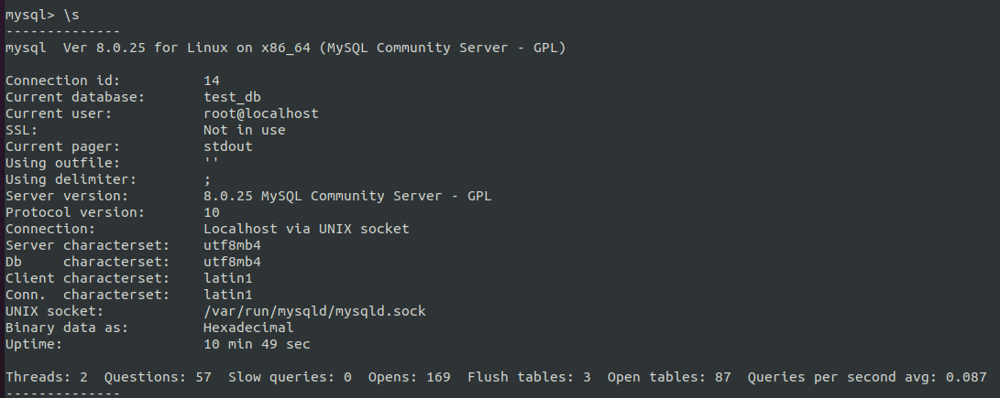
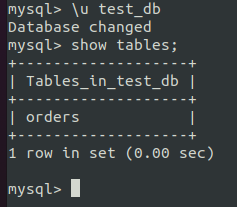
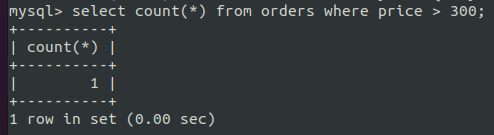
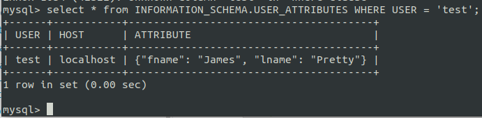
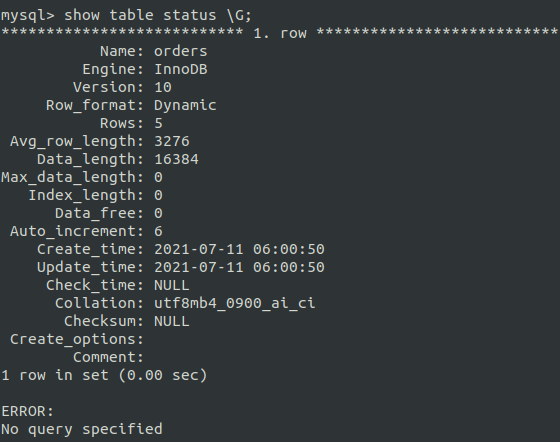
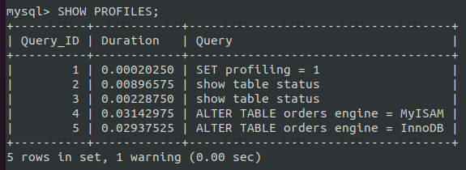
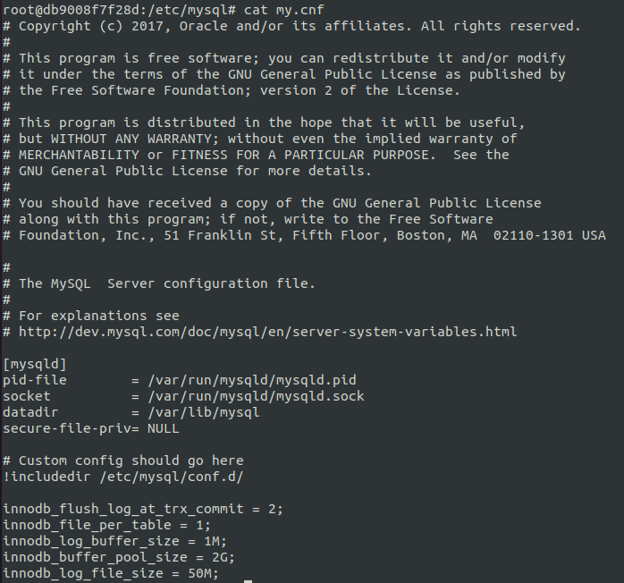

# Домашнее задание к занятию "6.3. MySQL"

## Введение

Перед выполнением задания вы можете ознакомиться с 
[дополнительными материалами](https://github.com/netology-code/virt-homeworks/tree/master/additional/README.md).

## Задача 1

Используя docker поднимите инстанс MySQL (версию 8). Данные БД сохраните в volume.

Изучите [бэкап БД](https://github.com/netology-code/virt-homeworks/tree/master/06-db-03-mysql/test_data) и 
восстановитесь из него.

Перейдите в управляющую консоль `mysql` внутри контейнера.

Используя команду `\h` получите список управляющих команд.

Найдите команду для выдачи статуса БД и **приведите в ответе** из ее вывода версию сервера БД.
- `\s`

Подключитесь к восстановленной БД и получите список таблиц из этой БД.

- `\u test_db`
- `show tables;`

**Приведите в ответе** количество записей с `price` > 300.

  - `select count(*) from orders where price > 300;`

В следующих заданиях мы будем продолжать работу с данным контейнером.

## Задача 2

Создайте пользователя test в БД c паролем test-pass, используя:
- плагин авторизации mysql_native_password
- срок истечения пароля - 180 дней 
- количество попыток авторизации - 3 
- максимальное количество запросов в час - 100
- аттрибуты пользователя:
    - Фамилия "Pretty"
    - Имя "James"

`CREATE USER 'test'@'localhost' 
IDENTIFIED WITH mysql_native_password BY 'test-pass'
WITH MAX_QUERIES_PER_HOUR 100
PASSWORD EXPIRE INTERVAL 180 DAY
FAILED_LOGIN_ATTEMPTS 3 PASSWORD_LOCK_TIME 2 
ATTRIBUTE '{"fname": "James", "lname": "Pretty"}';`

Предоставьте привелегии пользователю `test` на операции SELECT базы `test_db`.

  - `GRANT SELECT ON test_db.* TO 'test'@'localhost';`    

Используя таблицу INFORMATION_SCHEMA.USER_ATTRIBUTES получите данные по пользователю `test` и 
**приведите в ответе к задаче**.
- `SELECT * FROM INFORMATION_SCHEMA.USER_ATTRIBUTES WHERE USER = 'test';`

## Задача 3

Установите профилирование `SET profiling = 1`.
Изучите вывод профилирования команд `SHOW PROFILES;`.

Исследуйте, какой `engine` используется в таблице БД `test_db` и **приведите в ответе**.
   - `show table status \G;`
   - **InnoDB**

     
Измените `engine` и **приведите время выполнения и запрос на изменения из профайлера в ответе**:
- на `MyISAM`
- на `InnoDB`

- ` ALTER TABLE orders engine = MyISAM;`
- ` ALTER TABLE orders engine = InnoDB;`

## Задача 4 

Изучите файл `my.cnf` в директории /etc/mysql.

Измените его согласно ТЗ (движок InnoDB):
- Скорость IO важнее сохранности данных
   - innodb_flush_log_at_trx_commit = 2;
- Нужна компрессия таблиц для экономии места на диске
   - innodb_file_per_table = 1;
- Размер буффера с незакомиченными транзакциями 1 Мб
   - innodb_log_buffer_size = 1M;
- Буффер кеширования 30% от ОЗУ
   - innodb_buffer_pool_size = 2G;
- Размер файла логов операций 100 Мб
   - innodb_log_file_size = 50M;

Приведите в ответе измененный файл `my.cnf`.

