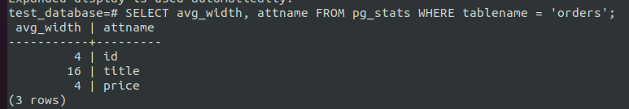

# Домашнее задание к занятию "6.4. PostgreSQL"

## Задача 1

Используя docker поднимите инстанс PostgreSQL (версию 13). Данные БД сохраните в volume.

Подключитесь к БД PostgreSQL используя `psql`.

Воспользуйтесь командой `\?` для вывода подсказки по имеющимся в `psql` управляющим командам.

**Найдите и приведите** управляющие команды для:
- вывода списка БД
  - `\l[+]   [PATTERN]      list databases`
- подключения к БД
  - `\c[onnect] {[DBNAME|- USER|- HOST|- PORT|-] | conninfo} connect to new database (currently "netology")`
- вывода списка таблиц
  - `\dt[S+] [PATTERN]      list tables`
- вывода описания содержимого таблиц
  - `\d[S+]  NAME           describe table, view, sequence, or index`
- выхода из psql
  - `\q                     quit psql`  

## Задача 2

Используя `psql` создайте БД `test_database`.
    - `CREATE DATABASE test_database;`

Изучите [бэкап БД](https://github.com/netology-code/virt-homeworks/tree/master/06-db-04-postgresql/test_data).

Восстановите бэкап БД в `test_database`.

Перейдите в управляющую консоль `psql` внутри контейнера.

Подключитесь к восстановленной БД и проведите операцию ANALYZE для сбора статистики по таблице.

Используя таблицу [pg_stats](https://postgrespro.ru/docs/postgresql/12/view-pg-stats), найдите столбец таблицы `orders` 
с наибольшим средним значением размера элементов в байтах.

**Приведите в ответе** команду, которую вы использовали для вычисления и полученный результат.
  - `SELECT avg_width FROM pg_stats WHERE tablename = 'orders';`

## Задача 3

Архитектор и администратор БД выяснили, что ваша таблица orders разрослась до невиданных размеров и
поиск по ней занимает долгое время. Вам, как успешному выпускнику курсов DevOps в нетологии предложили
провести разбиение таблицы на 2 (шардировать на orders_1 - price>499 и orders_2 - price<=499).

Предложите SQL-транзакцию для проведения данной операции.
  - `CREATE TABLE orders_more_499_price (CHECK (price > 499)) INHERITS (orders);`
  - `INSERT INTO orders_more_499_price SELECT * FROM orders WHERE price > 499;`  
  - `CREATE TABLE orders_less_499_price (CHECK (price <= 499)) INHERITS (orders);`
  - `INSERT INTO orders_LESS_499_price SELECT * FROM orders WHERE price <= 499;`
  - `DELETE FROM ONLY orders;`

Можно ли было изначально исключить "ручное" разбиение при проектировании таблицы orders?
  - **Можно, установив правила вставки в основную таблицу**
  - `CREATE RULE orders_insert_to_more AS ON INSERT TO orders WHERE ( price > 499 ) DO INSTEAD INSERT INTO orders_more_499_price VALUES (NEW.*);`
  - `CREATE RULE orders_insert_to_less AS ON INSERT TO orders WHERE ( price <= 499 ) DO INSTEAD INSERT INTO orders_less_499_price VALUES (NEW.*);`

## Задача 4

Используя утилиту `pg_dump` создайте бекап БД `test_database`.

Как бы вы доработали бэкап-файл, чтобы добавить уникальность значения столбца `title` для таблиц `test_database`?
  - **Добавил бы данную строчку после создания таблицы: `ALTER TABLE ONLY public.test_database ADD CONSTRAINT test_database_title_key UNIQUE (title);`**

