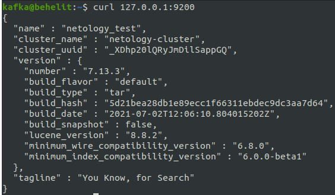
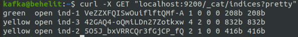
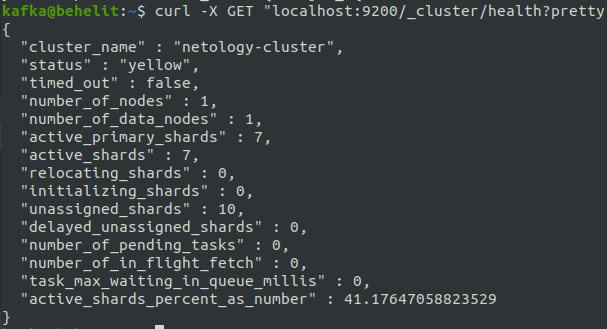
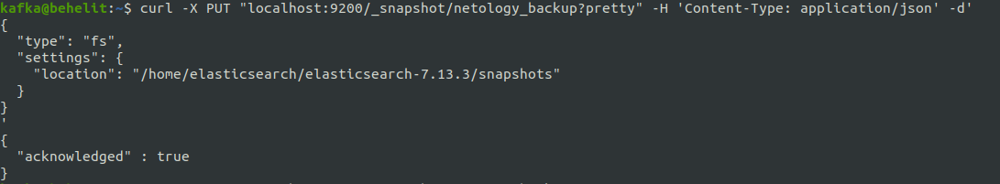
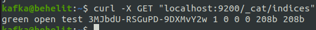
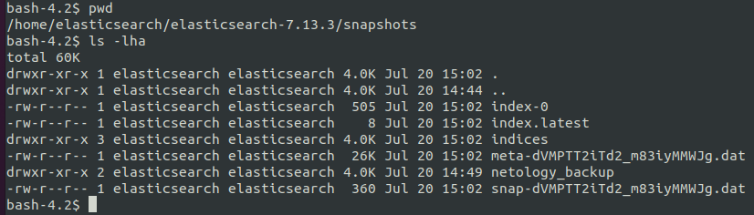
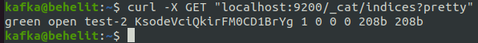
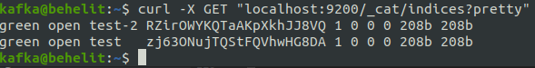

# Домашнее задание к занятию "6.5. Elasticsearch"

## Задача 1

В этом задании вы потренируетесь в:
- установке elasticsearch
- первоначальном конфигурировании elastcisearch
- запуске elasticsearch в docker

Используя докер образ [centos:7](https://hub.docker.com/_/centos) как базовый и 
[документацию по установке и запуску Elastcisearch](https://www.elastic.co/guide/en/elasticsearch/reference/current/targz.html):

- составьте Dockerfile-манифест для elasticsearch
- соберите docker-образ и сделайте `push` в ваш docker.io репозиторий
  - `docker build -t elasticsearch .`
  - `docker image tag elasticsearch kafka0238/elasticsearch:latest`  
  - `docker image push kafka0238/elasticsearch:latest`  
- запустите контейнер из получившегося образа и выполните запрос пути `/` c хост-машины
  - `docker run -p9200:9200 elasticsearch`  

Требования к `elasticsearch.yml`:
- данные `path` должны сохраняться в `/var/lib`
- имя ноды должно быть `netology_test`
```yaml
cluster.name: netology-cluster
node.name: netology_test
network.host: 0.0.0.0
discovery.type: single-node
path.data: /var/lib/elasticsearch
```

В ответе приведите:
- текст Dockerfile манифеста 
```yaml
FROM    centos:7

WORKDIR /home/elasticsearch/

RUN     yum update -y && yum install wget -y
RUN     wget https://artifacts.elastic.co/downloads/elasticsearch/elasticsearch-7.13.3-linux-x86_64.tar.gz
RUN     tar -xzf elasticsearch-7.13.3-linux-x86_64.tar.gz
COPY 	elasticsearch.yml /home/elasticsearch/elasticsearch-7.13.3/config/
RUN     mkdir /var/lib/elasticsearch
RUN     groupadd elasticsearch && useradd elasticsearch -g elasticsearch -p elasticsearch && \
        chown -R elasticsearch:elasticsearch /home/elasticsearch/ && chown -R elasticsearch:elasticsearch /var/lib/elasticsearch

EXPOSE  9200

WORKDIR /home/elasticsearch/elasticsearch-7.13.3/

USER    elasticsearch:elasticsearch

CMD     ["bash", "./bin/elasticsearch"]
```

- ссылку на образ в репозитории dockerhub
  - [dockerhub repo with elasticsearch](https://hub.docker.com/r/kafka0238/elasticsearch)
- ответ `elasticsearch` на запрос пути `/` в json виде



Подсказки:
- возможно вам понадобится установка пакета perl-Digest-SHA для корректной работы пакета shasum
- при сетевых проблемах внимательно изучите кластерные и сетевые настройки в elasticsearch.yml
- при некоторых проблемах вам поможет docker директива ulimit
- elasticsearch в логах обычно описывает проблему и пути ее решения

Далее мы будем работать с данным экземпляром elasticsearch.

## Задача 2

В этом задании вы научитесь:
- создавать и удалять индексы
- изучать состояние кластера
- обосновывать причину деградации доступности данных

Ознакомтесь с [документацией](https://www.elastic.co/guide/en/elasticsearch/reference/current/indices-create-index.html) 
и добавьте в `elasticsearch` 3 индекса, в соответствии со таблицей:
```
curl -X PUT "localhost:9200/ind-1?pretty" -H 'Content-Type: application/json' -d'
{
  "settings": {
    "number_of_shards": 1,
    "number_of_replicas": 0
  }
}
'
```
```
curl -X PUT "localhost:9200/ind-2?pretty" -H 'Content-Type: application/json' -d'
{
  "settings": {
    "number_of_shards": 2,
    "number_of_replicas": 1
  }
}
'
```
```
curl -X PUT "localhost:9200/ind-3?pretty" -H 'Content-Type: application/json' -d'
{
  "settings": {
    "number_of_shards": 4,
    "number_of_replicas": 2
  }
}
'
```

| Имя | Количество реплик | Количество шард |
|-----|-------------------|-----------------|
| ind-1| 0 | 1 |
| ind-2 | 1 | 2 |
| ind-3 | 2 | 4 |

Получите список индексов и их статусов, используя API и **приведите в ответе** на задание.
  - `curl -X GET "localhost:9200/_cat/indices?pretty"`  



Получите состояние кластера `elasticsearch`, используя API.
  - `curl -X GET "localhost:9200/_cluster/health?pretty"` 


Как вы думаете, почему часть индексов и кластер находится в состоянии yellow?

  - **Первичный шард и реплика не могут находиться на одном узле, если копия не назначена. Таким образом, один узел не может размещать копии**

Удалите все индексы.

**Важно**

При проектировании кластера elasticsearch нужно корректно рассчитывать количество реплик и шард,
иначе возможна потеря данных индексов, вплоть до полной, при деградации системы.

## Задача 3

В данном задании вы научитесь:
- создавать бэкапы данных
- восстанавливать индексы из бэкапов

Создайте директорию `{путь до корневой директории с elasticsearch в образе}/snapshots`.

Используя API [зарегистрируйте](https://www.elastic.co/guide/en/elasticsearch/reference/current/snapshots-register-repository.html#snapshots-register-repository) 
данную директорию как `snapshot repository` c именем `netology_backup`.

**Приведите в ответе** запрос API и результат вызова API для создания репозитория.

```
curl -X PUT "localhost:9200/_snapshot/netology_backup?pretty" -H 'Content-Type: application/json' -d'
{
  "type": "fs",
  "settings": {
    "location": "/home/elasticsearch/elasticsearch-7.13.3/snapshots"
  }
}
'
```


Создайте индекс `test` с 0 реплик и 1 шардом и **приведите в ответе** список индексов.

```
curl -X PUT "localhost:9200/test?pretty" -H 'Content-Type: application/json' -d'
{
  "settings": {
    "number_of_shards": 1,
    "number_of_replicas": 0
  }
}
'
```




[Создайте `snapshot`](https://www.elastic.co/guide/en/elasticsearch/reference/current/snapshots-take-snapshot.html) 
состояния кластера `elasticsearch`.
  - `curl -X PUT "localhost:9200/_snapshot/netology_backup/snapshot_1?wait_for_completion=true&pretty"`
  - `curl -X GET "localhost:9200/_snapshot/netology_backup/_all?pretty"`

**Приведите в ответе** список файлов в директории со `snapshot`ами.


Удалите индекс `test` и создайте индекс `test-2`. **Приведите в ответе** список индексов.
  - `curl -X DELETE "localhost:9200/test?pretty"`
```
curl -X PUT "localhost:9200/test-2?pretty" -H 'Content-Type: application/json' -d'
{
  "settings": {
    "number_of_shards": 1,
    "number_of_replicas": 0
  }
}
'
```


[Восстановите](https://www.elastic.co/guide/en/elasticsearch/reference/current/snapshots-restore-snapshot.html) состояние
кластера `elasticsearch` из `snapshot`, созданного ранее. 

  - `curl -X POST "localhost:9200/_snapshot/netology_backup/snapshot_1/_restore?pretty"`

**Приведите в ответе** запрос к API восстановления и итоговый список индексов.

  - `curl -X POST "localhost:9200/_snapshot/netology_backup/snapshot_1/_restore?pretty"`
  - `curl -X GET "localhost:9200/_cat/indices?pretty"`  



Подсказки:
- возможно вам понадобится доработать `elasticsearch.yml` в части директивы `path.repo` и перезапустить `elasticsearch`

